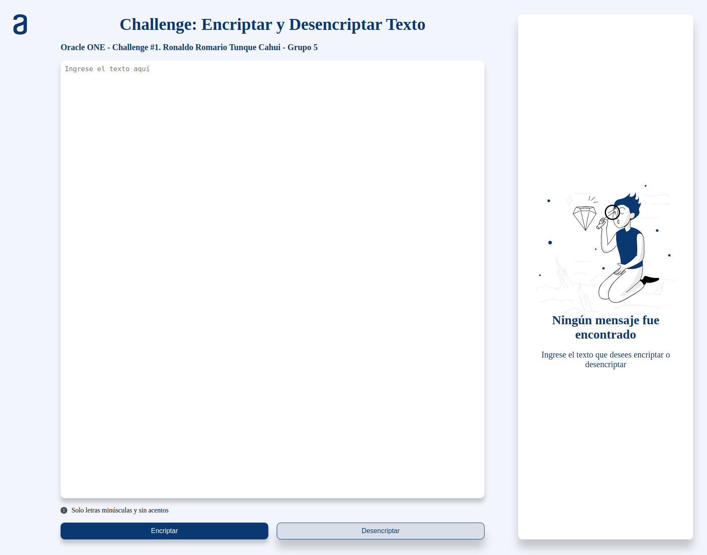

# Oracle + Alura LATAM - Challenge 01. Encriptar y Desencriptar Texto

<div align="center"></div>
<div align="center"></div>

# 1. Encriptador de texto

<div align="center">
  
</div>
<br />
<div align="center">
  
</div>

<div align="center">
  
  
  
</div>

---

## 2. Descripción

Este es un pequeño programa que te permite encriptar y desencriptar texto utilizando algoritmo de sustitución. Ha sido creado con HTML5, CSS3 y JS. Es fácil de usar y adecuado para encriptar mensajes cortos, aunque no se recomienda para encriptar información confidencial, ya que el algoritmo de sustitución es relativamente fácil de romper.

---

## 3. Llaves de encriptacion

Las llaves de encriptacion solicitadas son las siguientes:

- La letra "**a**" es convertida a "**ai**".
- La letra "**e**" es convertida a "**enter**".
- La letra "**i**" es convertida a "**imes**".
- La letra "**o**" es convertida a "**ober**"
- La letra "**u**" es convertida a "**ufat**"

---

## 4. Requisitos

- Debe funcionar solo con letras minúsculas.
- No deben ser utilizados letras con acentos ni caracteres especiales.
- Debe ser posible convertir una palabra para la versión encriptada también devolver una palabra encriptada para su versión original.

```
Por ejemplo:
"gato" => "gaitober"
gaitober" => "gato"
```

- La página debe tener campos para inserción del texto que será encriptado o desencriptado, y el usuario debe poder escoger entre as dos opciones.
- El resultado debe ser mostrado en la pantalla.

### 5. Extras:

- Un botón que copie el texto encriptado/desencriptado para la sección de transferencia, o sea que tenga la misma funcionalidad del ctrl+C o de la opción "copiar" del menú de las aplicaciones.

---

### 6. Autor:
- Ronaldo Romario Tunque Cahui <br>
<a href="https://www.linkedin.com/in/ronaldotunquecahui" target="_blank" rel="noopener"></a>

### 7. Badge:
<div align="center"></div>
